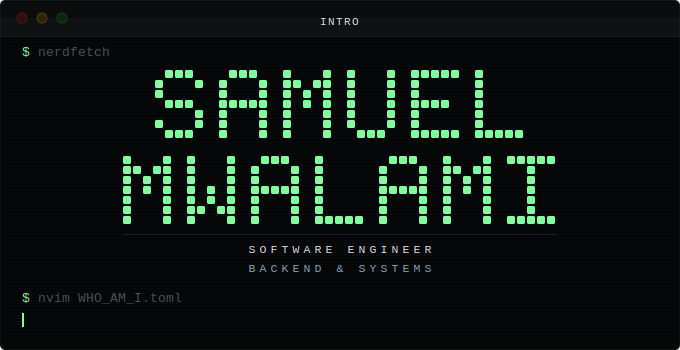
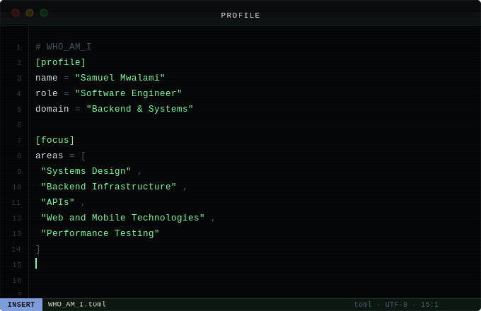
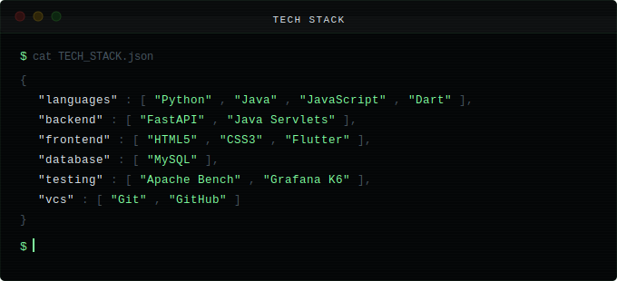
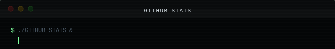
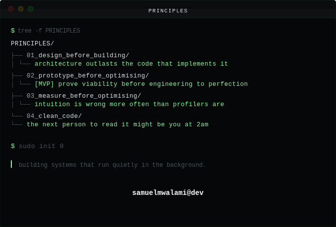

<!-- Header -->

 

<!-- Links -->

&nbsp;&nbsp;

<!-- Profile -->

 

 
 

<!-- Stack Badges -->

<!-- Tech stack termianl -->

 

 
 

<!-- Github stats -->

<!-- Activity graph -->

<!-- stats -->

&nbsp;&nbsp;

 

 
 

<!-- principles -->

 

